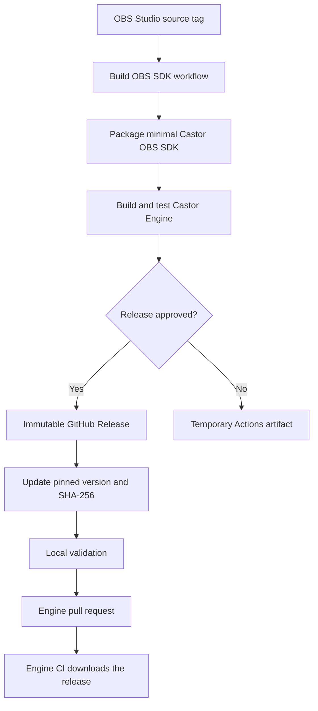

# OBS SDK Build, Release, and Consumption Workflow

## Purpose

Castor Engine uses `libobs`, but it does not build OBS Studio during every
engine build. Instead, the project produces a small, versioned Castor OBS SDK,
publishes it as an immutable GitHub Release, and then consumes that exact
archive locally and in Engine CI.

This document explains:

- the responsibility of each workflow and supporting file;
- the order in which the workflows must run;
- how to publish and adopt a new OBS SDK version;
- how to reproduce the Engine CI build locally;
- why production and consumption are intentionally separated;
- which invariants must be preserved when maintaining the pipeline.

## Architecture overview



There are two independent lifecycle operations:

1. **Production** builds, validates, and publishes an OBS SDK.
2. **Adoption** updates Castor Engine to consume a published SDK.

Publishing a release does not automatically change the version used by Castor
Engine. Adoption always happens in a separate, reviewable pull request.

## Design principles

### The SDK is an immutable dependency

An SDK release is identified by its version, archive name, and SHA-256:

```text
OBS version:     32.1.2
Castor revision: 1
SDK version:     32.1.2-castor.1
Release tag:     32.1.2-castor.1
Archive:         Castor.Obs.Sdk.win-x64-32.1.2-castor.1.zip
```

Once a tag has been published, its assets must not be replaced. If the package
contents or packaging rules change for the same OBS version, increment the
Castor revision:

```text
32.1.2-castor.1 -> 32.1.2-castor.2
```

For a new upstream OBS version, start again at revision `1` unless that version
already has a Castor SDK release:

```text
32.1.2-castor.2 -> 32.1.3-castor.1
```

This makes every build traceable and prevents a release from changing without
its version changing.

### Production and adoption are separated

The production workflow temporarily injects the requested OBS version, Castor
revision, and generated SHA-256 into the runner checkout. It uses those values
to validate the newly generated archive, but it never commits them.

The permanent version and SHA-256 are changed later in an adoption pull
request. This separation is intentional:

- a failed SDK build cannot modify the engine dependency;
- publishing a release cannot silently update `main`;
- the engine PR shows the exact version and checksum change;
- rollback only requires restoring the previous pinned metadata;
- Engine CI always tests a release that already exists.

### The published archive is the tested archive

The release job downloads the validated artifact produced by its dependency
job, verifies its SHA-256 again, and publishes those same files. It must not
rebuild OBS or repackage the SDK during publication.

This avoids validating one archive and releasing another.

### CMake does not own release downloads

The local developer or Engine CI downloads the archive. CMake receives either:

- `CASTOR_OBS_SDK_ARCHIVE_PATH`, pointing to the ZIP archive; or
- `CASTOR_OBS_SDK_ROOT`, pointing to an already extracted SDK.

Keeping network access out of CMake makes configuration reproducible and keeps
GitHub authentication concerns outside the build system.

### Integrity is checked before compilation

The bootstrap validates:

- the archive SHA-256;
- required headers, libraries, DLLs, and CMake package files;
- the SDK version stored in `manifest.json`;
- the target runtime identifier;
- the existence of the `OBS::libobs` CMake target.

Do not bypass these checks to make a build pass. A mismatch means that the
archive, metadata, or selected release is incorrect.

## Responsibilities by file

| File | Responsibility |
|---|---|
| [`.github/workflows/build-obs-sdk.yml`](../.github/workflows/build-obs-sdk.yml) | Manually builds, packages, validates, and optionally publishes a Castor OBS SDK. |
| [`.github/workflows/engine-ci.yml`](../.github/workflows/engine-ci.yml) | Downloads the pinned GitHub Release and validates the normal Castor Engine build and managed tests. |
| [`.github/scripts/Package-ObsSdk.ps1`](../.github/scripts/Package-ObsSdk.ps1) | Selects SDK contents, generates `manifest.json`, creates the deterministic ZIP, and calculates its SHA-256. |
| [`cmake/dependencies/CastorObsSdkVersion.cmake`](../cmake/dependencies/CastorObsSdkVersion.cmake) | Source of truth for the OBS SDK currently consumed by Castor Engine. |
| [`cmake/dependencies/BootstrapCastorObsSdk.cmake`](../cmake/dependencies/BootstrapCastorObsSdk.cmake) | Validates and extracts the SDK, then exposes `OBS::libobs` to the engine build. |
| [`sdk/obs/manifest.template.json`](../sdk/obs/manifest.template.json) | Defines the manifest structure. Version fields are filled by the packaging script. |
| [`sdk/obs/cmake/libobsConfig.cmake`](../sdk/obs/cmake/libobsConfig.cmake) | Defines the relocatable `OBS::libobs` CMake target shipped in the SDK. |
| [`Castor.Engine.Host/CMakeLists.txt`](../Castor.Engine.Host/CMakeLists.txt) | Links the native host to `OBS::libobs` and installs the OBS runtime beside the engine runtime. |
| [`Castor.Engine.Tests/Castor.Engine.Tests.csproj`](../Castor.Engine.Tests/Castor.Engine.Tests.csproj) | Copies the installed native runtime into the test output and prevents managed tests from building without it. |
| [`sdk/obs/README.md`](../sdk/obs/README.md) | Human-readable summary of the currently adopted OBS SDK. |

## Workflow 1: build and publish an OBS SDK

### Trigger

Run **Build OBS SDK** manually from GitHub Actions with:

| Input | Meaning | Example |
|---|---|---|
| `obs_version` | Existing OBS Studio Git tag to build. | `32.1.3` |
| `castor_revision` | Positive package revision for that OBS version. | `1` |
| `publish_release` | Whether to wait for approval and publish a GitHub Release. | `true` |

The workflow must be available on the default branch. Run it from the commit
that contains the packaging rules that should be associated with the release.
The generated release tag points to that commit for traceability.

Runs for the same OBS version and Castor revision share a concurrency group and
are not canceled automatically. This prevents a long, potentially publishable
OBS build from being terminated by a duplicate dispatch.

### Build and validation order

The `build-and-validate-windows-x64` job performs these operations in order:

1. Validate the input formats and reject a release tag that already exists.
2. Temporarily configure the requested version in the runner checkout.
3. Check out the exact upstream OBS Studio tag with its submodules.
4. Build OBS Studio for Windows x64 using `RelWithDebInfo`.
5. Install the OBS development component.
6. Verify that the required headers, import libraries, CMake files, and runtime
   DLLs were produced.
7. Run `Package-ObsSdk.ps1`.
8. Compare the generated ZIP, checksum file, and packaging-script SHA-256.
9. Temporarily configure the generated SHA-256 for the bootstrap test.
10. Configure, build, and install Castor Engine with the generated ZIP.
11. Use `dumpbin` to verify that `Castor.Engine.Host.dll` imports `obs.dll`.
12. Restore, build, and run the managed integration tests.
13. Upload the validated ZIP and `.sha256` as a GitHub Actions artifact.

The order matters:

- packaging cannot happen before the development files are installed;
- engine configuration is the first real consumer test of the generated ZIP;
- installation must happen before managed tests because it assembles the
  complete native runtime expected by the test project;
- publication is allowed only after native linkage and managed integration
  have both succeeded.

### Why `dumpbin` is required

Declaring `OBS::libobs` in `target_link_libraries` is not enough to prove that
the final DLL imports `obs.dll`. If the host does not reference an OBS symbol,
the linker can omit the dependency.

The native host exposes an OBS version call, and `dumpbin /dependents` verifies
the resulting PE import table. Keep this check in the workflow: it catches a
real integration regression earlier than a runtime load failure.

### Temporary artifact versus GitHub Release

The build job always creates a GitHub Actions artifact with a limited retention
period. It is useful for diagnostics and non-publishing validation runs, but it
is not a permanent dependency source.

Engine CI and local release tests consume GitHub Release assets because releases
are stable, versioned, and intended for long-term distribution.

### Publication order

When `publish_release` is `true`, the `publish-release` job:

1. waits for the build and validation job to pass;
2. waits for approval through the `obs-sdk-release` environment;
3. downloads the validated Actions artifact;
4. verifies the ZIP and `.sha256` again;
5. generates release notes;
6. creates the immutable tag and GitHub Release;
7. uploads the ZIP and `.sha256` as release assets.

The environment must exist under:

```text
Repository Settings -> Environments -> obs-sdk-release
```

Configure at least one required reviewer. If the maintainer who runs the
workflow is also the reviewer, GitHub's self-review prevention must remain
disabled.

The workflow has read-only repository permissions by default. Only the
publication job receives `contents: write`, limiting write access to the step
that creates the tag and release.

## Workflow 2: adopt a published SDK

Publishing is not the end of the update. Castor Engine must explicitly adopt
the new release.

### Adoption order

1. Confirm that the GitHub Release contains exactly:
   - `Castor.Obs.Sdk.win-x64-<sdk-version>.zip`;
   - `Castor.Obs.Sdk.win-x64-<sdk-version>.zip.sha256`.
2. Copy the SHA-256 from the checksum asset or the successful workflow output.
3. Create a dedicated engine branch.
4. Update
   [`CastorObsSdkVersion.cmake`](../cmake/dependencies/CastorObsSdkVersion.cmake):

   ```cmake
   set(CASTOR_OBS_VERSION "<obs-version>")
   set(CASTOR_OBS_SDK_REVISION "<castor-revision>")

   set(
       CASTOR_OBS_SDK_SHA256
       "<release-archive-sha256>"
   )
   ```

5. Update the human-readable values in
   [`sdk/obs/README.md`](../sdk/obs/README.md).
6. Validate the released SDK locally using the procedure below.
7. Commit and push the adoption change.
8. Open a pull request and let **Engine CI** validate the release again.

Do not update the pinned SHA-256 before the release exists. Engine CI downloads
the archive from the release tag calculated from the committed OBS version and
Castor revision.

The manifest template does not require a manual version update:
`Package-ObsSdk.ps1` replaces its version fields while staging the archive.

## Workflow 3: Engine CI

**Engine CI** runs for pull requests and pushes to `main` or `dev`.

It performs the normal consumer path:

1. Read the OBS version, Castor revision, and platform from
   `CastorObsSdkVersion.cmake`.
2. Derive the release tag and archive name.
3. Download the exact ZIP from the matching GitHub Release.
4. pass the archive through `CASTOR_OBS_SDK_ARCHIVE_PATH`;
5. run a fresh CMake configuration;
6. build and install the native engine and OBS runtime;
7. restore, build, and run the managed tests.

`cmake --fresh` is important when switching SDK versions because it prevents a
previous CMake cache from selecting an older extracted SDK.

The CMake bootstrap recalculates the archive SHA-256 during configuration.
Therefore, downloading an asset with the correct name is not sufficient: its
contents must also match the checksum committed in the engine branch.

## Local validation with the released SDK

### Prerequisites

Use Windows x64 with:

- Visual Studio 2022 and the MSVC x64 toolchain;
- CMake 3.25 or later;
- .NET SDK 8;
- GitHub CLI authenticated for the repository.

Run every command from the Castor Engine repository root in PowerShell.

### 1. Read the pinned metadata and download the release

The following commands derive the release name from the CMake source of truth,
so they remain valid after an SDK update:

```powershell
$versionContents = Get-Content `
  "cmake/dependencies/CastorObsSdkVersion.cmake" `
  -Raw

function Get-CMakeValue([string] $name) {
  $pattern = (
    'set\s*\(\s*' +
    [regex]::Escape($name) +
    '\s*"([^"]+)"\s*\)'
  )

  $match = [regex]::Match($versionContents, $pattern)

  if (!$match.Success) {
    throw "$name was not found."
  }

  return $match.Groups[1].Value
}

$obsVersion = Get-CMakeValue "CASTOR_OBS_VERSION"
$revision = Get-CMakeValue "CASTOR_OBS_SDK_REVISION"
$platform = Get-CMakeValue "CASTOR_OBS_SDK_PLATFORM"
$expectedSha256 = Get-CMakeValue "CASTOR_OBS_SDK_SHA256"

$sdkVersion = "$obsVersion-castor.$revision"
$archiveName = "Castor.Obs.Sdk.$platform-$sdkVersion.zip"
$downloadDirectory = "artifacts/obs-sdk-release"

New-Item `
  -ItemType Directory `
  -Force `
  $downloadDirectory | Out-Null

gh release download $sdkVersion `
  --repo "Castor-Studio/Castor-Engine" `
  --pattern "$archiveName*" `
  --dir $downloadDirectory `
  --clobber

if ($LASTEXITCODE -ne 0) {
  throw "Failed to download OBS SDK release $sdkVersion."
}

$sdkArchive = (
  Resolve-Path (Join-Path $downloadDirectory $archiveName)
).Path
```

### 2. Verify the release archive

```powershell
$actualSha256 = (
  Get-FileHash -LiteralPath $sdkArchive -Algorithm SHA256
).Hash.ToLowerInvariant()

if ($actualSha256 -ne $expectedSha256) {
  throw (
    "Invalid SDK checksum. " +
    "Expected $expectedSha256, received $actualSha256."
  )
}

Write-Host "SDK checksum valid: $actualSha256"
```

The bootstrap repeats this verification during CMake configuration. The
explicit check here produces a clearer error before the native build starts.

### 3. Configure, build, and install the native runtime

Pass the ZIP directly to CMake. Do not extract it manually:

```powershell
cmake --fresh --preset windows-x64 `
  "-DCASTOR_OBS_SDK_ARCHIVE_PATH=$sdkArchive"

cmake --build --preset windows-x64-release

cmake --install build/windows-x64 `
  --config Release `
  --prefix artifacts/runtime/win-x64
```

The configure step validates and extracts the SDK under the CMake build
directory. The install step assembles `Castor.Engine.Host.dll`, the OBS runtime
DLLs, plugins, and data under `artifacts/runtime/win-x64`.

### 4. Run the managed integration tests

```powershell
dotnet restore Castor.Engine.Tests/Castor.Engine.Tests.csproj

dotnet build Castor.Engine.Tests/Castor.Engine.Tests.csproj `
  --configuration Release `
  --no-restore

dotnet test Castor.Engine.Tests/Castor.Engine.Tests.csproj `
  --configuration Release `
  --no-build
```

Do not skip the native install step. The test project intentionally fails its
build when `Castor.Engine.Host.dll` is absent and copies the installed runtime
DLLs into the managed test output.

## SDK contents and scope

The SDK contains only what Castor Engine needs:

- public libobs headers;
- `obs.lib` and `w32-pthreads.lib`;
- a relocatable CMake package exposing `OBS::libobs`;
- the OBS runtime and required dependencies;
- selected capture, audio, encoding, output, source, filter, transition, and
  service plugins;
- plugin and libobs data files;
- OBS and available third-party license notices;
- `manifest.json`.

The package intentionally excludes:

- the OBS frontend executable;
- Qt;
- CEF;
- frontend and WebSocket APIs;
- OBS scripting, Lua, and unused data-channel runtime;
- PDB debugging symbols.

Keep the selection in `Package-ObsSdk.ps1` explicit. Adding all OBS build output
would increase package size, create unnecessary runtime dependencies, and blur
the boundary between libobs integration and the OBS desktop application.

## Maintenance checklist

### When upgrading OBS Studio

- [ ] Confirm that the upstream OBS tag exists.
- [ ] Review OBS release notes for build-system, plugin, and runtime changes.
- [ ] Review the selected plugins and excluded runtime patterns.
- [ ] Run **Build OBS SDK** with the new OBS version and revision `1`.
- [ ] Approve the `obs-sdk-release` publication only after validation succeeds.
- [ ] Confirm the ZIP and `.sha256` assets on the GitHub Release.
- [ ] Update the pinned version, revision, and SHA-256 in a dedicated PR.
- [ ] Update `sdk/obs/README.md`.
- [ ] Run the complete local validation sequence.
- [ ] Require Engine CI to pass before merging.

### When changing packaging without upgrading OBS

- [ ] Keep the same OBS version.
- [ ] Increment `CASTOR_OBS_SDK_REVISION`.
- [ ] Publish a new immutable release.
- [ ] Adopt the new revision through the normal engine PR.

### When changing the native OBS integration

- [ ] Keep `OBS::libobs` linked privately to `Castor.Engine.Host`.
- [ ] Keep at least one real OBS symbol referenced by the host.
- [ ] Keep the `dumpbin` dependency check in the SDK validation workflow.
- [ ] Install all required runtime DLLs, plugins, and data before managed tests.
- [ ] Update native and managed integration tests together.

## Troubleshooting

| Failure | Likely cause | Correct action |
|---|---|---|
| The release tag already exists. | The version and revision identify an immutable published SDK. | Increase the Castor revision or run without publication for diagnostics. |
| OBS checkout cannot find the requested ref. | `obs_version` is not an existing upstream OBS tag. | Correct the workflow input; do not invent a local-only version. |
| Archive SHA-256 mismatch. | The wrong archive was downloaded, an asset changed, or the committed checksum is wrong. | Compare the release asset and checksum, then correct the adoption PR. Do not disable verification. |
| Manifest version or platform mismatch. | Archive metadata does not match the pinned CMake metadata. | Select the correct release or rebuild it with the correct inputs. |
| `dumpbin` does not list `obs.dll`. | The host is not actually using or linking libobs. | Verify `OBS::libobs` linkage and a real OBS symbol reference in the native host. |
| `Castor.Engine.Host.dll` is missing during managed build. | The native configure/build/install sequence was skipped or used another prefix. | Install to `artifacts/runtime/win-x64` before building the tests. |
| Managed tests cannot load a native dependency. | The installed runtime is incomplete or was not copied to the test output. | Inspect `artifacts/runtime/win-x64/bin` and the test project copy items. |
| Release job is waiting. | The `obs-sdk-release` environment requires approval. | Review the completed validation job, then approve or reject publication. |
| Engine CI cannot download the release. | The pinned tag does not exist or the expected archive is missing. | Publish the SDK first, then update the engine metadata. |

## Invariants

The following rules define the safety of this pipeline:

1. Never overwrite an existing SDK release or reuse its version for different
   contents.
2. Never adopt an SDK before its GitHub Release exists.
3. Never publish an archive that did not pass the native and managed integration
   tests in the same workflow run.
4. Never remove SHA-256 or manifest validation to work around an error.
5. Never make the normal Engine CI rebuild OBS Studio.
6. Never consume a temporary Actions artifact in the permanent Engine CI.
7. Always install the native runtime before running managed tests.
8. Always update the human-readable SDK summary with the pinned CMake metadata.

These constraints keep local builds, pull-request validation, and released SDK
assets aligned around the same versioned dependency.
